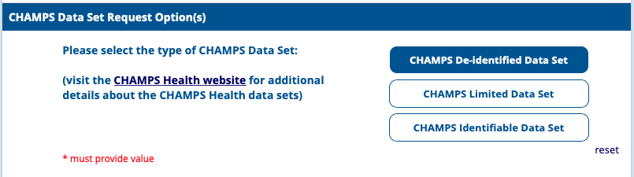

```{r, include = FALSE}
knitr::opts_chunk$set(
  collapse = TRUE,
  comment = "#>"
)
```

The CHAMPS (Child Health and Mortality Preventions Surveillance) website[^1] provides access to varying levels of detail of the collected data[^2]. Only the de-identified (L2) data that can be downloaded after you [register and request the data](https://champs.emory.edu/redcap/surveys/?s=PCEERX993Y)[^3] from Emory University will work with this package.

You will need to complete the survey to create an account that requires a mobile number and an email address. After completing the registration survey, the website will redirect you to a log in survey. Upon logging in, you will see the CHAMPS Data Access Request Form.

You want to select _'CHAMPS De-identified Data Set'_ and then submit that form.



On the following page, you will need to state your purpose for requesting the data and provide a digital signature to the Data Transfer Agreement. After signing the agreement, you can then click submit at the bottom of the page. Immediately after submitting, you will get two emails from data@champshealth.org. 

__CHAMPS De-identified Data Set Request Successfully Submitted__

```
Hi [NAME],

Your request for a CHAMPS De-identified Data Set was submitted.

If you completed the digital signature and agreed to the full transmission of 
the request, you will soon receive an email from data@champshealth.org 
containing a secure link to the requested data set. This is a one-time-use 
link, which will expire in five (5) days.

If you submitted an incomplete request or attempted to cancel your request, 
then no further emails from data@champshealth.org should be expected.

Please find attached a PDF copy of your request application attached.

Thank you,

CHAMPS Program Office
```

__CHAMPS Data Set Request__

```
Hello [NAME],

Here is the one-time-use link required to download the CHAMPS De-identified 
Data Set you requested.
One time use link: (https://[LINK])

This link will expire in five days.

Thank you,
CHAMPS Program Office
```

Using the link provided in your email, you can then download the `CHAMPS_de_identified_data_<VERSION_DATE>.zip` folder. This unzipped folder is the directory that you will use with the champs package with `load_data()`. You must have all the files listed below within the directory to have the R package's full functionality.

- CHAMPS De-Identified Data Set Description v4.1.pdf 
- CHAMPS_dataset_version.csv 
- CHAMPS_deid_basic_demographics.csv
- CHAMPS_deid_decode_results.csv
- CHAMPS_deid_lab_results.csv 
- CHAMPS_deid_tac_results.csv 
- CHAMPS_deid_verbal_autopsy.csv 
- CHAMPS_ICD_Mappings.csv 
- CHAMPS_icd10_descriptions.csv 
- CHAMPS_vocabulary.csv 

[^1]: https://champshealth.org/
[^2]: https://champshealth.org/data-access/
[^3]: https://champs.emory.edu/redcap/surveys/?s=PCEERX993Y
